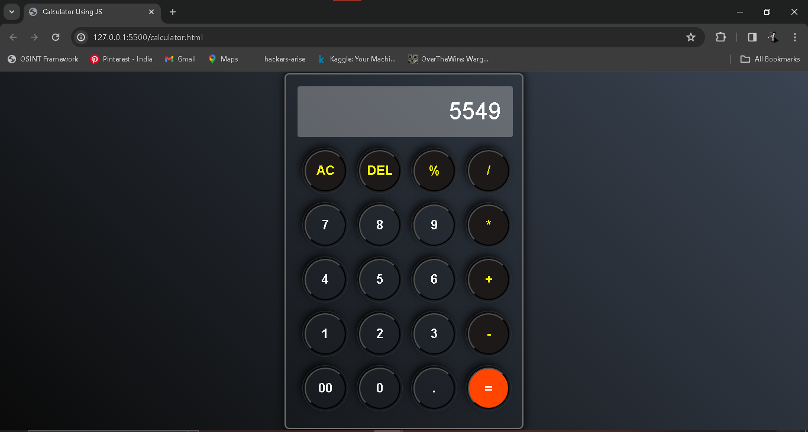

# 🧮 Calculator App

A simple calculator application built using **HTML**, **CSS**, and **JavaScript**. Developed as part of **CODSOFT Web Development Task-3**, this project demonstrates basic arithmetic operations and user interface design.

## 🌐 Live Demo

Experience the live calculator here: [Calculator App](https://x0lg0n.github.io/Calculator/)

## 🖼️ Preview



## 🛠️ Technologies Used

- **HTML5**: Structuring the web page and elements.
- **CSS3**: Styling and layout design.
- **JavaScript**: Implementing calculator functionalities and interactivity.

## 📂 Project Structure

```
Calculator/
├── index.html          # Main HTML file
├── style.css          # CSS file for styling
├── script.js          # JavaScript file for calculator logic
├── preview.png        # Screenshot of the calculator app
└── README.md          # Project documentation
```

## 🚀 Features

- **Basic Arithmetic Operations**: Perform addition, subtraction, multiplication, and division.
- **Responsive Design**: Optimized for various screen sizes and devices.
- **User-Friendly Interface**: Intuitive layout with clear buttons and display.

## 📄 Description

The Calculator App is designed to handle basic mathematical calculations efficiently. Users can input numbers and select operations using the on-screen buttons. The app provides real-time results and handles edge cases like division by zero gracefully.

## 🛠️ Installation and Usage

To run the Calculator App locally:

1. **Clone the repository**:

   ```bash
   git clone https://github.com/x0lg0n/Calculator.git
   ```

2. **Navigate to the project directory**:

   ```bash
   cd Calculator
   ```

3. **Open `index.html` in your preferred web browser** to start using the calculator.

## 🧑‍💻 Contributing

Contributions are welcome! If you have suggestions or improvements:

1. **Fork the repository**.
2. **Create a new branch** for your feature or fix.
3. **Commit your changes** with clear messages.
4. **Push to your forked repository**.
5. **Submit a pull request** detailing your changes.

## 📄 License

This project is licensed under the **MIT License**. See the [LICENSE](LICENSE) file for more details.

---

Feel free to customize and enhance the Calculator App as you see fit!
